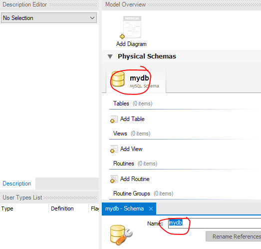
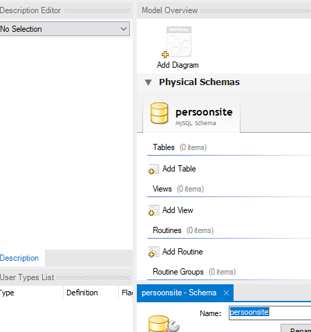
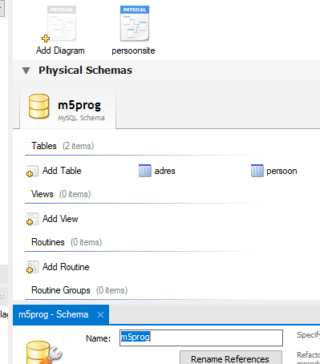

## Adres


We gaan nu oefenen met tables maken


## Adres modeleren

we gaan een table maken waar een adres in opgeslagen kan worden


### start

- maak met `mysql workbench` een nieuw diagram
>

### database target

- lees het volgende:
```
standaard heet de schema mydb
dat is niet nuttig die hebben wij niet
dus moeten we het schema hernoemen
```
- click op mydb
>
- verander mydb in 
    - m5prog

### controle

- check of je nu dit hebt:
>

### diagram hernoemen

- hernoem nu het diagram naar:
    - persoonsite
    >

- controller of je nu dit hebt:
>

### tabellen

- open het diagram (dubbel click)
- maak een nieuwe table:
    - adres
- open de table zodat je colommen kan toevoegen

### wat zit er in?

- lees deze uitleg:
```
* als er `schrijf op` staat hieronder. Doe dat in een tekstfile `03 notities.txt` die je gemaakt had
```
- zoek het adres van een bedrijf uit nederland op
- schrijf op uit welke:
    - eigenschappen/variabelen dat adres bestaat 
    > denk bv aan straat/nummer etc...
- voor elke eigenschap:
    - denk nu aan het `datatype` van de waarde!
        > bijvoorbeeld een straat is een string dus een varchar in databaseland 
        - schrijf dat achter de eigenschap

### colommen

- de eerste colomn noemen we even `adresID`, type `int`
- vink aan:
    - `Primary key`
    - `AI`
    - `not null`
    - `unsigned` 
    - `unique`
- denk even na waarom we dit doen
    - schrijf dat op in `03 notities.txt`
- maak nu colommen aan voor alle variable die je hebt bedacht in stap  `wat zit er in?`
- kies het juiste datatype 
- vink voor alle colommen het volgende aan:
    - `not null`

### inleveren
- sla het diagram op in je `Db opdrachten` map
- maak een `screenshot` van het `diagram` en zet dat in je `Db opdrachten` map


## git

commit naar je git repository voor de vak!